# Sunny — Feature Guide

Every screen in the app, what it does, and why it works that way.

**ICL Hackathon 2026 · Education Technology · [github.com/ArthurAlexandre28/Hackathon_ICL](https://github.com/ArthurAlexandre28/Hackathon_ICL)**

Screenshots are from the running prototype, captured headlessly against the live server —
not mockups. Desktop shots are the teacher view at 1280px; mobile shots are the child view
at 390px, the screen a visiting judge actually uses.

> **Note on the AI wording:** these captures were taken without `ANTHROPIC_API_KEY` set, so
> step 5 shows the written-template fallback. With a key configured, that step is generated
> live. Both states are documented below.

---

## Contents

**Getting in** — [Role choice](#1-role-choice) · [Class code](#2-class-code) · [Find your name](#3-find-your-name) · [Teacher PIN](#4-teacher-pin)
**The child's app** — [Face scale](#5-the-face-scale) · [Why tags](#6-optional-why-tags) · [Thank you](#7-thank-you) · [My check-ins](#8-my-check-ins) · [Worried about someone](#9-worried-about-someone)
**The teacher's dashboard** — [Overview](#10-the-dashboard) · [Stats row](#11-stats-row) · [Class grid](#12-class-grid) · [Signals list](#13-soft-signals)
**The signal panel** — [Five steps](#14-the-five-step-signal-panel) · [Step 1](#step-1--the-data) · [Step 2](#step-2--the-rule-that-fired) · [Step 3](#step-3--what-this-does-not-mean) · [Step 4](#step-4--what-a-human-knows) · [Step 5](#step-5--where-ai-is-used)
**The five rules in action** — [R1](#r1--sudden-change-cody) · [R3](#r3--repeating-cycle-maia) · [R4](#r4--stopped-checking-in-isla) · [R5](#r5--may-not-be-reading-ben)
**Human context** — [Notes from home](#notes-from-home) · [Concerns from classmates](#concerns-from-classmates)
**Escalation** — [Preview](#15-escalation--the-preview) · [Audit trail](#16-escalation--the-audit-trail)
**Transparency & presenting** — [How Sunny works](#17-how-sunny-works) · [Big screen](#18-big-screen-mode) · [Live mode](#19-live-mode)

---

# Getting in

## 1. Role choice

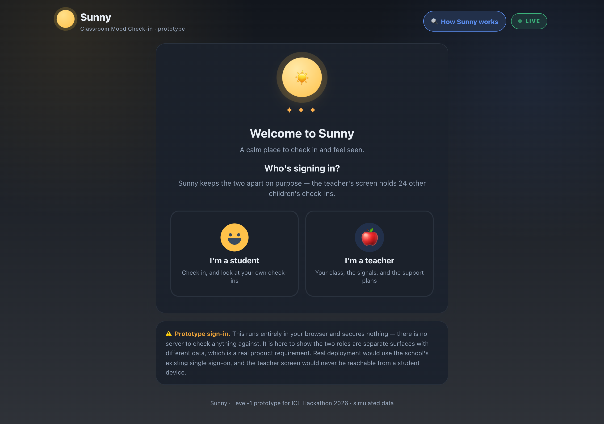

The first screen asks who you are. There is no shared entry point — a child and a teacher
take different paths from the very first tap, because they see fundamentally different
things.

## 2. Class code

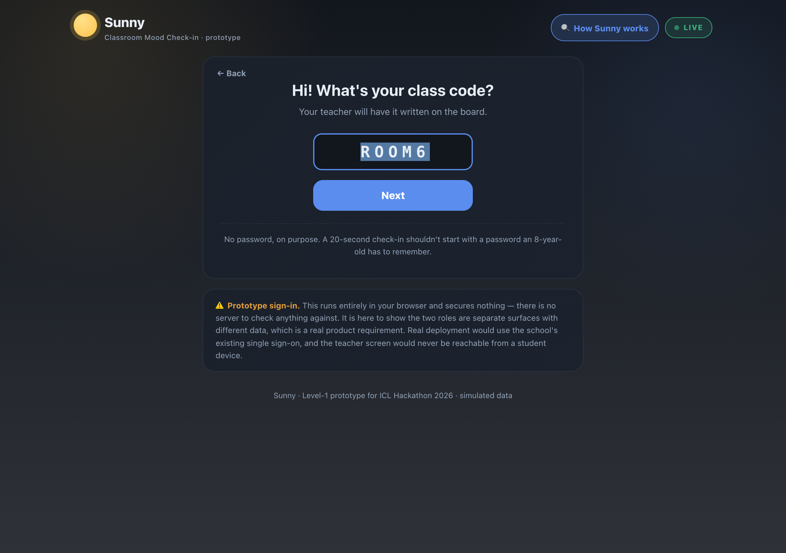

Children enter a class code (`ROOM6`), not a password. Eight-year-olds cannot be expected
to manage credentials, and a shared code scoped to one classroom is proportionate to what
is behind it.

## 3. Find your name

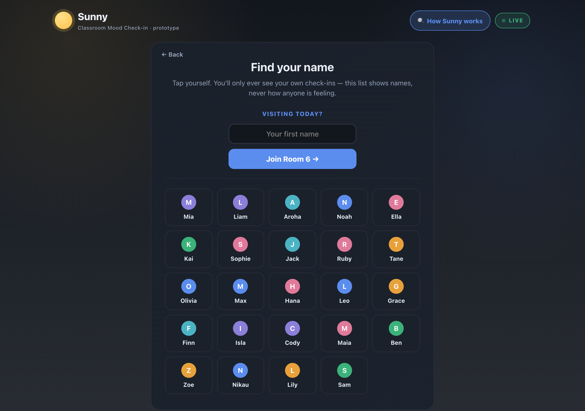

The child taps their own name from the class list. The note above it is deliberate: *"this
list shows names, never how anyone is feeling."* A child browsing this screen learns nothing
about a classmate.

In live mode a **"visiting today?"** box appears at the top of this screen, letting a judge
or guest join the class with just a first name.

## 4. Teacher PIN

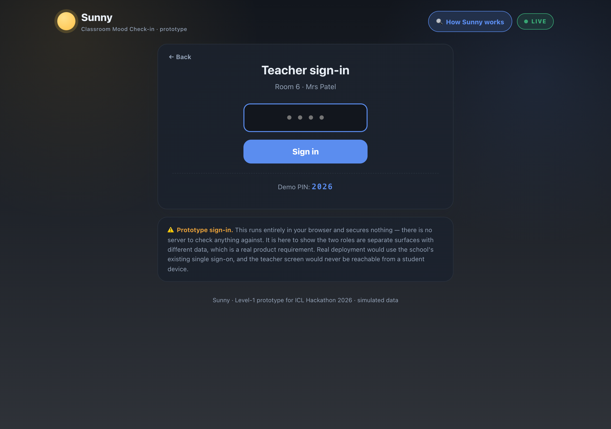

The teacher route is separate and PIN-gated.

> **Stated honestly:** this is client-side and demonstrates *role separation*, not security.
> The PIN is visible in the page source. Real deployment needs SSO against the school's
> existing identity provider. We would rather say this than let a judge discover it.

---

# The child's app

## 5. The face scale

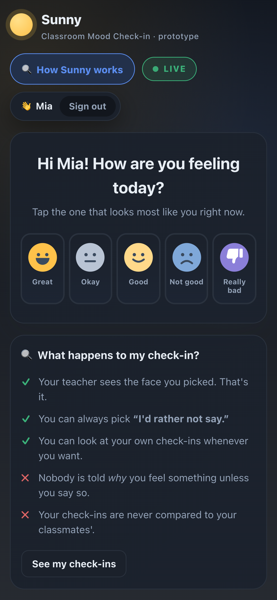

The entire child-facing product: one question, five faces, twenty seconds.

- **Faces, not words.** The psychometric literature finds face scales outperform visual
  analogue and Likert scales for this age group. We switched to faces on judge feedback and
  found the research agreed afterwards.
- **A thumbs-down at the bottom, not a crying face.** A crying face is a big claim for a
  child to make about themselves and is easy to avoid pressing. A thumbs-down is
  unmistakable and low-stakes.
- **The order is shuffled every time.** Look at the screenshot: the sequence reads
  *Great, Okay, Good, Not good, Really bad*. A neighbour cannot read your answer from where
  your thumb lands — which removes one reason to pick the safe face instead of the true one.
  It also makes rule R5 possible.
- **All five fit on one row at 390px.** Non-negotiable: an option that requires scrolling is
  an option nobody picks.

Below the scale, **"What happens to my check-in?"** explains the whole data policy in five
lines a child can read.

## 6. Optional "why" tags

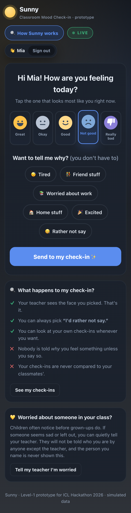

After tapping a face, the child *may* add one reason from a fixed list — including
**"I'd rather not say,"** which is a first-class option, not a fallback.

Fixed options, never free text. A child cannot write something a teacher hasn't reviewed,
and there is no free-text field to be misused in either direction.

## 7. Thank you

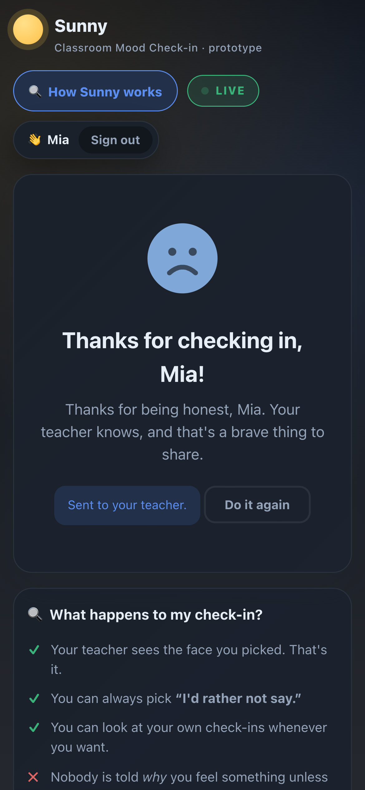

Confirmation, warmth, and nothing else. Critically, the child is **never told a rule fired
about them.** Being flagged is information for the adults around a child, not a label to
hand the child about themselves.

Confetti fires only on a good day. An earlier version celebrated every check-in — including
a thumbs-down, directly beneath *"that's a brave thing to share."* Fixed.

## 8. My check-ins

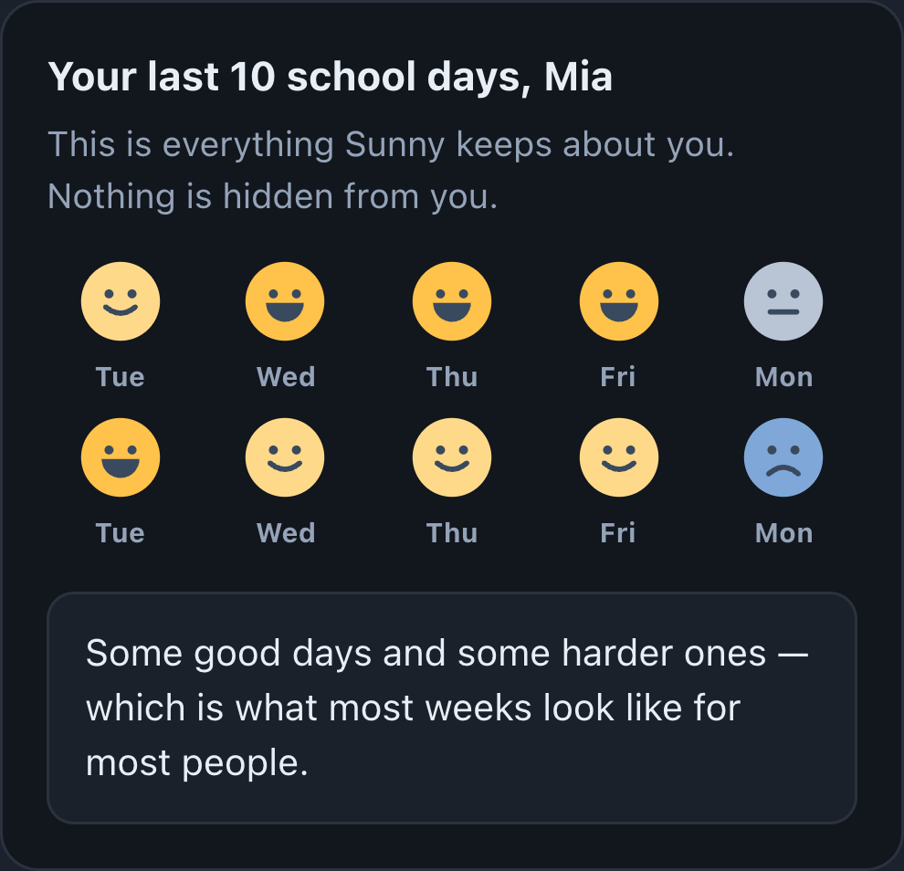

The child can see their own last ten days, any time, without asking. Nothing is hidden from
them about themselves.

What they see is only their own history — **no rule, no flag, no baseline, no comparison to
anyone.** This is enforced in the test suite: the child view is scanned for the words
*rule*, *flag*, *median*, and *baseline*, and fails if any appear.

## 9. Worried about someone

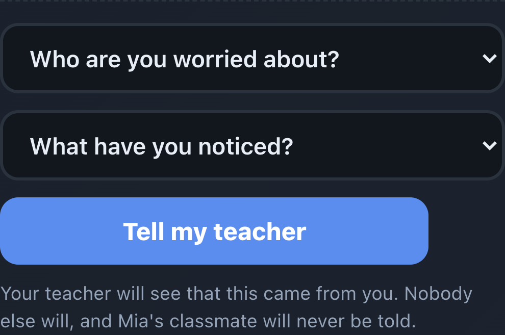

Children notice each other before adults do. This lets a child quietly tell the teacher.

A "report a classmate" button is trivially weaponised, so three constraints:

- **Never anonymous to the teacher** — misuse is traceable. This is telling a grown-up, not
  whistleblowing.
- **The named child never sees it**, it never feeds a rule, and it never marks their tile.
- **Fixed reasons only** — no free text a child could use to write something cruel.

---

# The teacher's dashboard

## 10. The dashboard

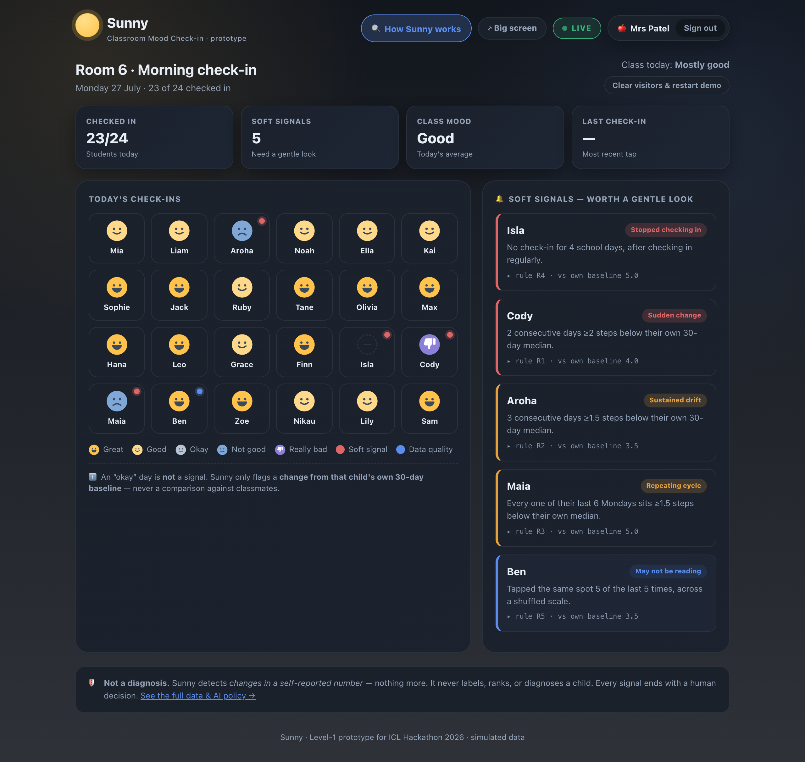

Everything a teacher needs in one screen: how many checked in, which few need a look, and
the whole class at a glance.

## 11. Stats row

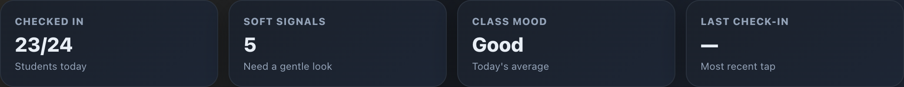

Four numbers: who checked in, how many signals, the class's overall mood, and when the last
tap arrived. In live mode the last figure updates as visitors check in.

## 12. Class grid

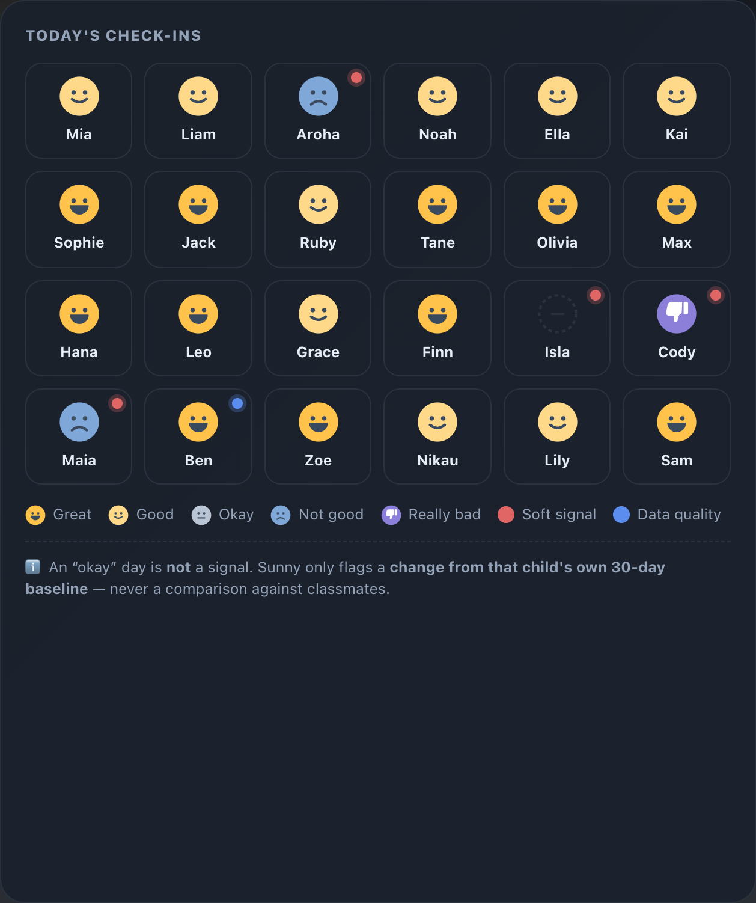

Every child, today's face, at a glance. Red dot = a wellbeing signal. Blue dot = a data
quality note (R5). Hollow dashed circle = **no check-in** — deliberately not a sad face,
because we do not know how they feel.

The note underneath carries the core design principle:

> *An "okay" day is **not** a signal. Sunny only flags a **change from that child's own
> 30-day baseline** — never a comparison against classmates.*

## 13. Soft signals

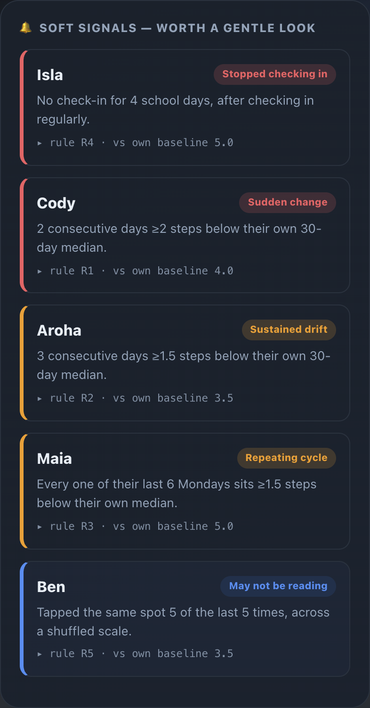

Not alarms — *"worth a gentle look."* Each card names the child, the rule, the plain-English
finding, and the arithmetic reference (`rule R1 · vs own baseline 4.0`).

Ordering is deliberate: high-priority wellbeing signals first, then watch-level, and the
data-quality note (Ben) always last and in a different colour, so it never borrows the
visual language of a concern about a child.

---

# The five-step signal panel

## 14. The five-step signal panel

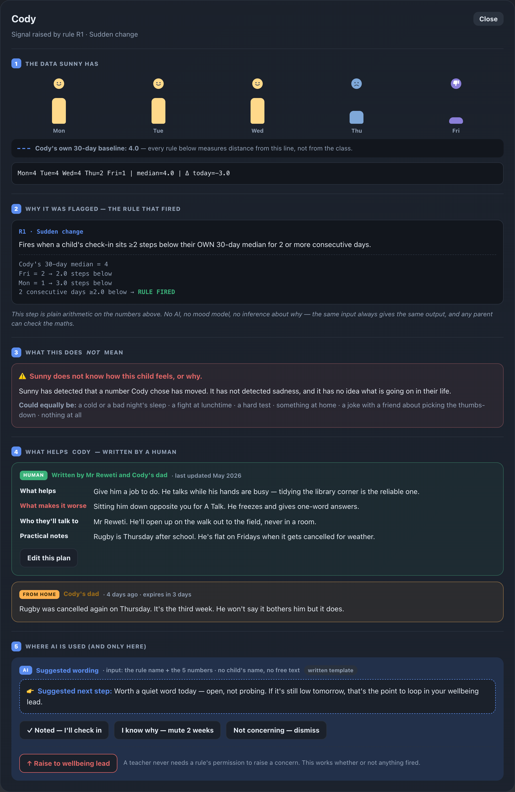

Clicking any child opens the same five steps, in the same order, every time. The order is
the argument: **evidence, then reasoning, then limits, then humans, then — last — the AI.**

### Step 1 — the data

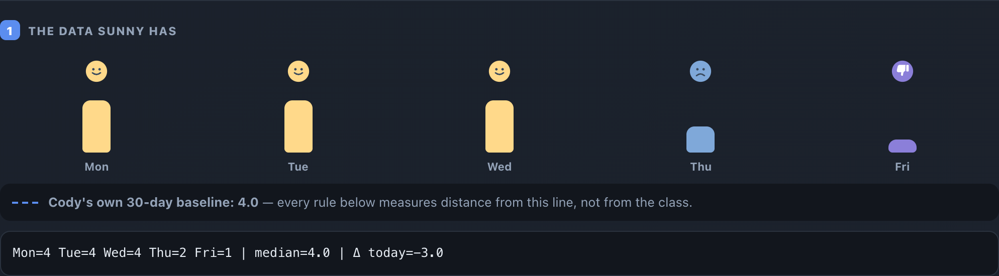

The child's last five school days as a chart, their own 30-day baseline drawn as a dashed
line, and the raw numbers in monospace beneath. Everything the rule saw, shown before any
conclusion is offered.

### Step 2 — the rule that fired

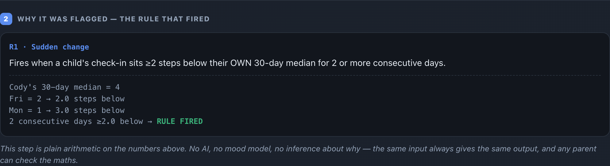

The rule, its exact threshold, and the arithmetic **generated from that child's real
numbers** — not a stored sentence. It ends with `RULE FIRED`.

Underneath: *"This step is plain arithmetic on the numbers above. No AI, no mood model, no
inference about why — the same input always gives the same output, and any parent can check
the maths."*

### Step 3 — what this does not mean

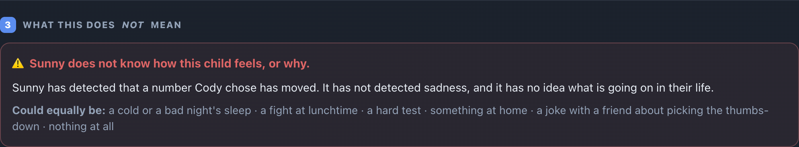

Every signal states its own limits before suggesting anything.

> **Sunny does not know how this child feels, or why.**

Then a list of innocent explanations — a cold, a bad night's sleep, a hard test, nothing at
all. A moved number is a moved number, not a diagnosis.

Opening an **unflagged** child shows this too: *no signal does not mean a child is fine.*

### Step 4 — what a human knows

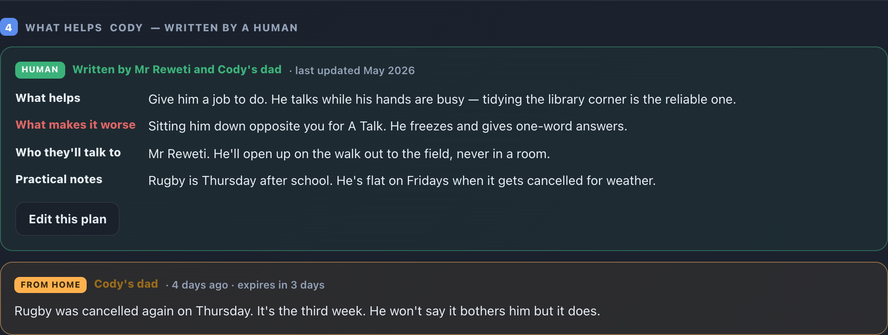

The support plan written by a parent or teacher: what helps, what makes it worse, who they
trust, practical notes. Plus any short-lived note from home and any concern raised by
classmates.

**This sits above the AI's suggestion, deliberately.** The people who know the child outrank
the model.

### Step 5 — where AI is used

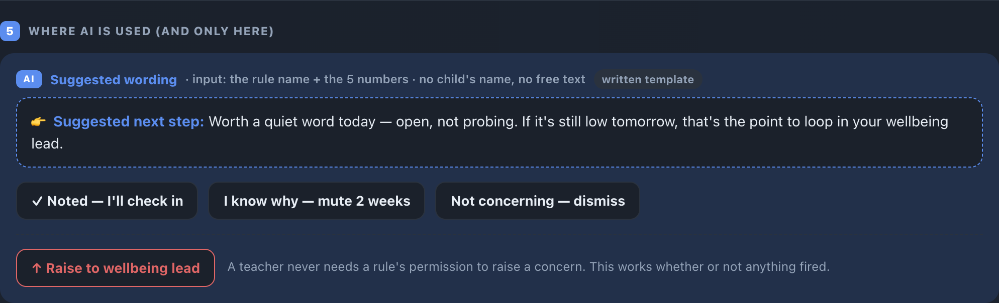

The only place a model appears, clearly labelled with exactly what it received:
*"input: the rule name + the 5 numbers · no child's name, no free text."*

A badge shows the current state — `written template`, `asking the model…`, or
`written live by the model`. With `ANTHROPIC_API_KEY` set this is a live Claude call; without
one it falls back to a written template. **Every failure path — no key, no network, timeout,
refusal — degrades to the template silently**, so the panel can never render empty.

Below it, the teacher's actions: *Noted*, *I know why — mute 2 weeks*, *Not concerning —
dismiss*, and *Raise to wellbeing lead*. Dismissals are logged so the false-positive rate can
be measured rather than guessed.

---

# The five rules in action

### R1 — Sudden change (Cody)


≥2 steps below his own median for 2 consecutive days. The fast-drop rule: bigger gap, shorter
window.

### R3 — Repeating cycle (Maia)

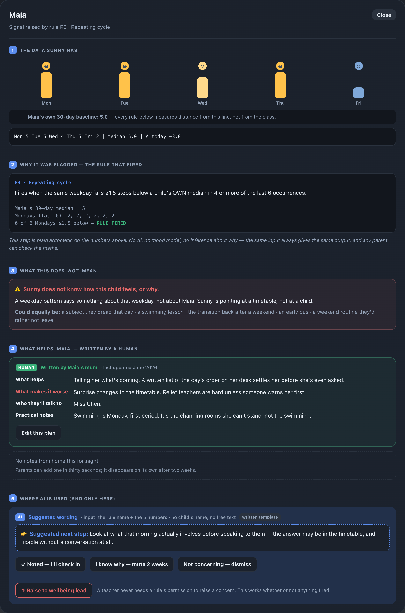

The same weekday low in ≥4 of the last 6 occurrences.

**This is the best demonstration in the product.** R3 reports *"every one of her last 6
Mondays sits below her own median."* It has no idea why. But her mum wrote in the support
plan, months ago: *"Swimming is Monday, first period. It's the changing rooms she can't stand,
not the swimming."*

The machine found the pattern. A human already knew the reason. Neither is much use alone.

### R4 — Stopped checking in (Isla)

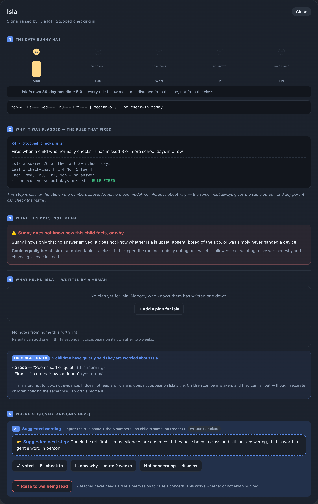

≥3 consecutive school days missed, by a child who was answering before.

A mood scale cannot express *"I have stopped answering."* A child who quietly disengages
produces no low scores at all — so without R4 they would be invisible at exactly the moment
you most want to see them. A missing day is treated as **missing data, never a low score**:
R1–R3 refuse to fire across a gap, because you cannot claim a three-day drift through a day
the child never answered.

### R5 — May not be reading (Ben)

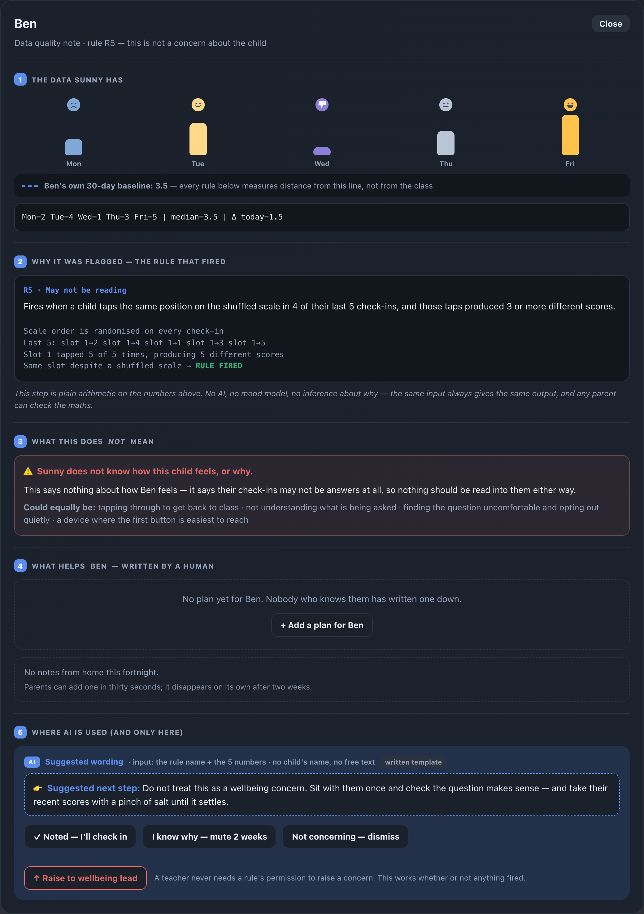

Same slot tapped in 4 of the last 5 check-ins, producing 3+ different scores. Against a
shuffled scale, that means tapping — not answering.

**R5 is deliberately not a wellbeing signal.** Different colour, different tile dot, sorts
last, and the panel opens by saying *this is not a concern about the child*. Its guidance is
to distrust that child's recent scores until it settles.

The product's whole claim is that it will not read meaning into a number it cannot stand
behind. R5 is that principle turned on our own input.

---

# Human context

### Notes from home

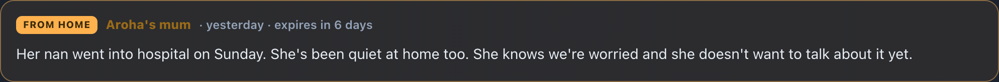

A parent adds short-lived context a teacher could not otherwise know — *"her nan went into
hospital on Sunday."* It expires on its own after a fortnight.

**Deliberately one-directional:** context flows in; the parent never sees the child's mood
data in return.

### Concerns from classmates

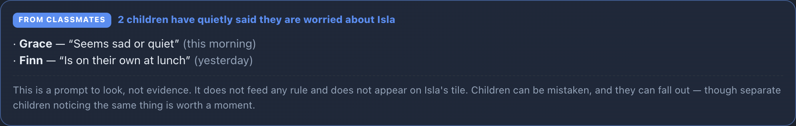

Where a child's quiet report surfaces for the teacher. The panel states plainly that this is
**a prompt to look, not evidence**, that children can be mistaken and can fall out — while
noting that several *independent* children flagging the same person is worth a moment.

---

# Escalation

## 15. Escalation — the preview

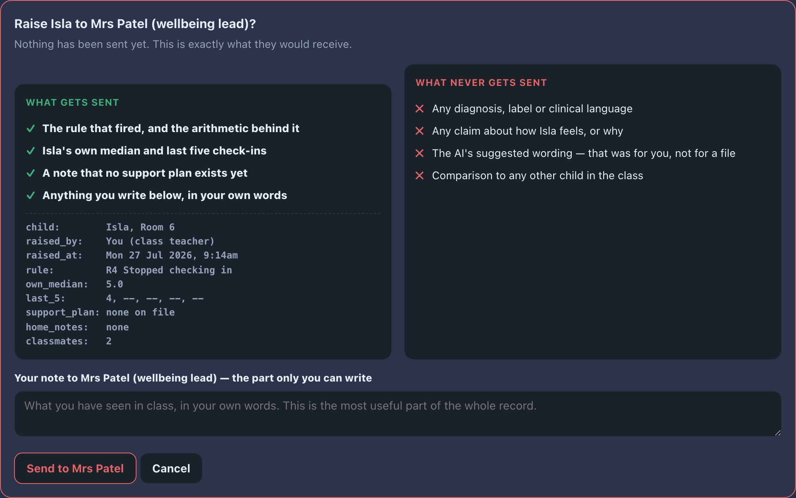

The only path by which anything leaves the classroom — and nothing sends until the teacher
sees exactly what would go.

**What gets sent:** the rule and its arithmetic, the child's own median and last five
check-ins, their support plan, and the teacher's own note.

**What never gets sent:** any diagnosis or clinical language, any claim about how the child
feels or why, **the AI's suggested wording** (that was for the teacher, not for a file), and
any comparison to another child.

Two deliberate choices:

- **Escalation never requires a rule to have fired.** A teacher does not need an algorithm's
  permission to raise a concern — the package simply reads `rule: none — raised manually`.
- **The teacher's own note is labelled** *"the part only you can write"* — because it is the
  most useful thing in the record.

## 16. Escalation — the audit trail

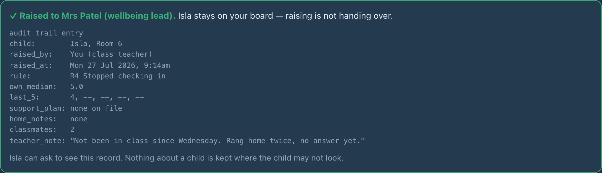

After sending: confirmation, the full audit entry, and the line that matters —

> *"[Child] can ask to see this record. Nothing about a child is kept where the child may not
> look."*

Also: *"raising is not handing over."* The child stays on the teacher's board. It is a second
pair of eyes, not a transfer of responsibility.

---

# Transparency & presenting

## 17. How Sunny works

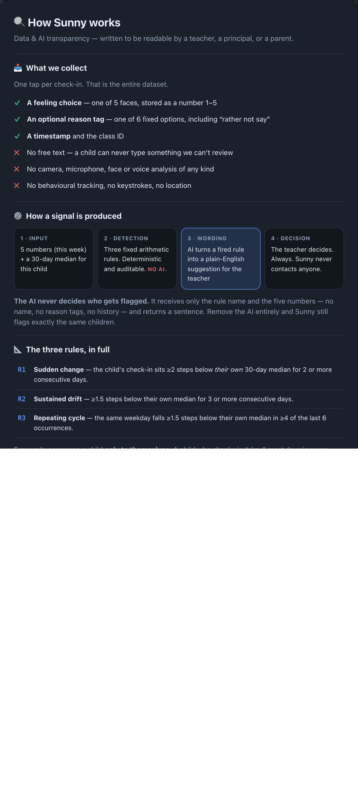

A full data and AI policy, reachable from every screen, written to be read by a teacher, a
principal, or a parent — not a developer.

Covers what is collected (one tap; no free text, camera, microphone or behavioural tracking),
the four-stage pipeline with **detection explicitly marked "No AI"**, all five rules printed
in full, what Sunny never does, and who sees what.

The line that carries the pitch:

> **Remove the AI entirely and Sunny flags exactly the same children.**

## 18. Big screen mode

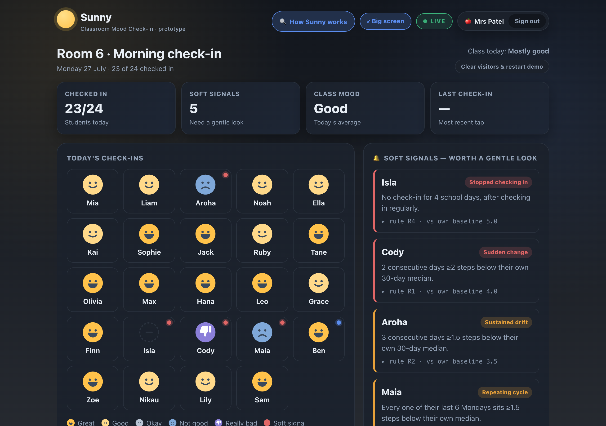

Scales the entire teacher view for a projector — names, signal cards, rule lines, tiles.
Only visible to a signed-in teacher, so a judge on their phone never sees it.

Built because 11px rule lines are decoration at ten metres.

## 19. Live mode

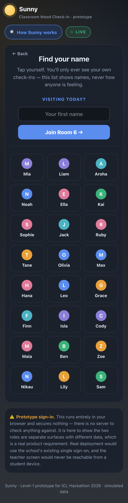

Served by `server.js`, the class becomes shared across devices. Visitors join on their own
phones and appear on the projected teacher screen within about 1.5 seconds, tagged **new**.
They join as *extra* students, so the seeded children keep their patterns and all five rules
still demonstrate.

The green **LIVE** badge confirms the connection; amber means it dropped.

**The server is a dumb store.** It holds check-ins and nothing else — the rule engine stays
in the browser, so *"detection is auditable arithmetic"* holds end to end. It is also why the
offline build is a complete product rather than a crippled one: open `index.html` from disk
with no server at all and every feature above still works.

---

## Reproducing these screenshots

```bash
node server.js          # in one terminal
node shoot.js ./docs/screenshots
```

`shoot.js` drives the running app in headless Chrome via `puppeteer-core` and writes one PNG
per feature. Requires Google Chrome installed and `npm install puppeteer-core`.
